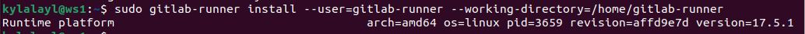
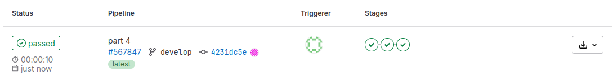
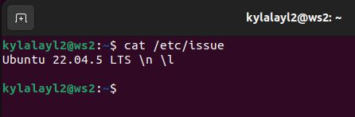
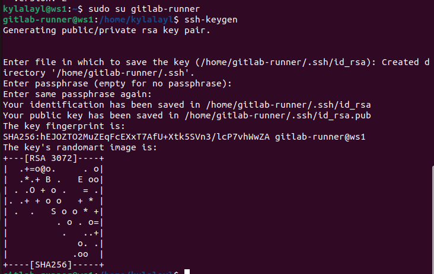
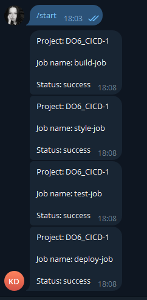

## Part 1. Настройка gitlab-runner

Поднимем виртуальную машину `Ubuntu Server 22.04 LTS`.

>Версия виртуальной машины

Скачаем и установим на виртуальную машину `gitlab-runner`. Воспользуемся командой `sudo curl -L --output /usr/local/bin/gitlab-runner "https://s3.dualstack.us-east-1.amazonaws.com/gitlab-runner-downloads/latest/binaries/gitlab-runner-linux-amd64"` для скачивания бинарного файла установки GitLab. 

>Скачали бинарный файл

Дадим файлу разрешение на исполнение с помощью выдачи прав командой `sudo chmod +x /usr/local/bin/gitlab-runner`

>Дали права на исполнение файла

Создадим пользователя GitLab

>Создание пользователя GitLab

Установим GitLab как службу с помощью команды `sudo gitlab-runner install --user=gitlab-runner --working-directory=/home/gitlab-runner`

>Установка службой

Запустим службу GitLab

>Запуск

Запустим gitlab-runner и зарегистрируем его для использования в текущем проекте (DO6_CICD).

Для этого необходимо ввести данные при регистрации:

Cвой URL-адрес GitLab, указанный в задании на странице `https://edu.21-school.ru`
Cвой регистрационный токен, указанный там же
Название раннера - DO6_CICD
Теги для заданий, разделенные запятыми - в моем случае - build, style, test, deploy
Тип исполнителя - shell

>Запуск и регистрация раннера

## Part 2. Сборка

Напишем этап для CI по сборке приложений из проекта `C2_SimpleBashUtils`. В файле `gitlab-ci.yml` добавим этап запуска сборки через мейк файл из проекта C2. Файлы, полученные после сборки (артефакты), сохраним в произвольную директорию со сроком хранения 30 дней.

>Файл `gitlab-ci.yml`

Однако при пуше возникает ошибка работы файла.

>Ошибка

Данная ошибка возникает, тк конфигурация `gitlab-runner`, по-умолчанию очищает терминал при выходе из оболочки `shell`. Закомментируем строки по пути `/home/gitlab-runner/.bash_logout` для решения данной ошибки.

>Комментирование файла конфигурации

Теперь перезапустим пайплайн и увидим отсутсвие ошибок

>Демонстрация успешной работы

## Part 3. Тест кодстайла

Напишем этап для CI, который запускает скрипт кодстайла (clang-format). Если кодстайл не прошел, то «зафейли» пайплайн. В пайплайне отобразим вывод утилиты clang-format.

Так же отредактируем `gitlab-ci.yml` для внесения этапа. 

>Добавление этапа для стиля

После пуша обновленного пайплайна заметим, что возникла ошибка, тк на нашей системе отсутсвует clang-format. Установим его с помощью команды `sudo apt install clang-format`

>Ошибка по стилю

После успешной установки clang-format и перезапуска раннера, заметим, что пайплайн успешно заработал

>Успешная работа

## Part 4. Интеграционные тесты

Напишем этап для CI, который запускает интеграционные тесты из того же проекта. Запустим этот этап автоматически только при условии, если сборка и тест кодстайла прошли успешно. Если тесты не прошли, то «зафейли» пайплайн. В пайплайне отобразим вывод, что интеграционные тесты успешно прошли / провалились.

Добавим этап для тестов в файл `gitlab-ci.yml`

>Изменение файла

После пуша файла, заметим, что пайплайн запустился отлично.

>Результат работы пайплайна

Так же, отображу, что происход вывод результатов тестов

>Тесты

## Part 5. Этап деплоя

Поднимем вторую виртуальную машину Ubuntu Server 22.04 LTS.

Для начала настроим файлы конфигурации машин на связь друг с другом

>Изменение файла конфига на машине ws1

>Изменение файла конфига на машине ws2

Обязательно принимаем изменения в настройках адаптеров с помощью команды `sudo netplan apply`. Проверим соединение между машинами 

Сгенерируем ssh-ключи для каждой машины с помощью команды `ssh-keygen`

>ws1

Теперь напишем bash-скрипт, который при помощи ssh и scp копирует файлы, полученные после сборки (артефакты), в директорию `/usr/local/bin` второй виртуальной машины.

>Скрипт

Напишем этап для CD, который «разворачивает» проект на другой виртуальной машине. 

>Запустим этот этап вручную при условии, что все предыдущие этапы прошли успешно.

>Дополнение файла `gitlab-ci.yml` новым этапом

Этап деплоя описан таким образом, что для получения доступа к удаленному серверу применяется ssh-агент. Для его работы необходимо будет выполнить определенный ряд действий

- Настройка ssh-агента
Изменения будут происходить от суперпользователя, поэтому сразу же перейдем в этот режим на ws1 с помощью команды `sudo su`

Перейдем в настройки раннера и обозначим ему где искать ssh-агента. Для этого в файле конфигураций добавим строку `environment = ["SSH_AUTH_SOCK=/tmp/ssh-agent"]`

Далее необходимо сохранить отпечаток удаленного сервера. Для этого ключ удаленного сервера необходимо добавить в файл `known_hosts` в домашнем каталоге пользователя `gitlab-runner`

Так как раннеру необходим приватный ключ, для того, чтобы не возникало проблем с ключами доступа к директории `/home/kylalayl/.ssh` и ее содержимому - скопируем закрытый ключ также в домашний каталог пользователя `gitlab-runner`. Выполним это с помощью команды `cp /home/kylalayl/.ssh/id_rsa /home/gitlab-runner/.ssh/`

Выйдя из режима суперпользователя, скопируем содержимое нашего открытого ssh-ключа на удаленный сервер с помощью команды `ssh-copy-id kylalayl@10.10.0.1`

Теперь запушим все это на ветку и проверим работоспособность пайплайна. Как можем заметить, пайплайн успешно отработал

>Корректная работа пайплайна

## Part 6. Дополнительно. Уведомления

Настроим уведомления об успешном/неуспешном выполнении пайплайна через бота с именем `kylalayl DO6_CI/CD` в Telegram.
Текст уведомления должен содержать информацию об успешности прохождения как этапа CI, так и этапа CD.

Найдем в телеграме через поиск `BotFather`. Это бот для создания других ботов в телеграме. Введем команду `/newbot` и введем название нашего бота `kylalayl DO6_CI/CD`

>Создание бота. На скриншоте видим, что нам выслали API бота. По этому API мы будем настраивать работу бота. 

Найдем другого бота в телеграме под наззванием `getmyid_bot` для понимания нашего IP.

Напишем скрипт, в котором опишем логику работы нашего бота

>Скрипт бота

Работа скрипта проходит успешно

>Работа бота

